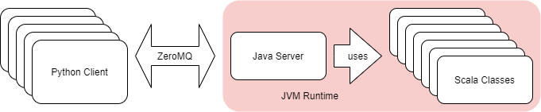

# SnowballSlingers!

This is a networked multiplayer game that uses a dedicated server. The goal of the game is to sling snowballs at others and be the last one standing!

The overall system will be laid out as per the following diagram:



As seen in the diagram, we will be using Python as the client service, with the server service written in Java that consumes classes written in Scala.

The game world state on the server side is managed by Scala. Java is meant as a networking layer so the Scala side has no involvement with networking.

The method of inter-process communication between the three languages presented here are as follows:

 - Using ZeroMQ for networking between the client and server (Python <-> Java)
 - Using the fact that both Java and Scala compiles to JVM bytecode to let Java consume classes written in Scala (Java <- Scala)

## Up and running

If you want to, you can simply start a server instance and two game clients (two because there's no other way to know that the multiplayer aspect is working) with the following commands:
```
xhost +local:docker # needed for X forwarding... read on to find out more
docker-compose up
```
I **HIGHLY** recommend that you finish reading this section first before attempting to run anything.

### game client

First and foremost, the client spawns a graphical PyGame window, this means that X forwarding is required if the project is to be run through docker-compose (This is only tested on a linux host environment that is running X as its display server). Fortunately most of the configuration is handled within `docker-compose.yml`. Prior to starting the client service, docker needs to be added to the list of hosts that the X server accepts:
```
xhost +local:docker
```
Then you can just run the docker command to start this service:
```
docker-compose up client
```
Otherwise, the only requirements to running the client is `pyzmq` and `pygame`, both can be installed through `pip`. 

We have the executables for both Windows and Linux on [Github Releases](https://github.com/jryzkns/snowballslingers/releases).

There is a copy of the game server running at `18.218.4.58`. If you would like to actually play the game, I would recommend asking someone else to grab the client and connect to that server with you and have an intense snowball fight ;)

### game server

I **STRONGLY** recommend starting up the server service first before attempting to run any clients. It takes longer for the server to launch than the clients, which means that clients will have trouble connecting to the server if the server loads after the client(s). Additionally, I have been seeing that starting the server service via `docker-compose up server` sometimes gets stuck at 
```
Downloaded from central: https://repo.maven.apache.org/maven2/commons-codec/commons-codec/1.11/commons-codec-1.11.jar
```
If that happens, simply cancel it (press ctrl + C twice) and run it again. Once again, a reminder that a server is running at `18.218.4.58`.

## How to play

The rectangular "totem" with a floating triangle above its head is the player that you are currently controlling.

Click any location on the screen with the right mouse button to move to that location (after holding down the mouse button you can move your mouse and your character will follow you as well).

You can throw a snowball at your mouse's cursor location by pressing the space bar (The snowball will only travel as far as where you put your mouse, so if you put your mouse really close to your totem, the snowball will not go far at all). 

You can only throw a snowball once every `0.5` seconds. This is reflected by the replenishing gauge on the left side of the player once a snowball has been thrown: a snowball can only be thrown when the gause is full.

The goal of the game is to dodge snowballs coming from other players in the game and hit other players with your snowballs. Each player has 3 health indicated by the little hearts on the right side of the player totem. Once you run out of health, you will immediately respawn as a different totem.

Pro tip: You can deflect incoming snowballs with your own snowballs.

Because you will be furiously clicking around on a small screen to move around and sling snowballs, you are bound to accidentally click out of the window and get interrupted. To account for this, you can lock your mouse cursor into the window by pressing the left control key. This is a toggle key so you can press it again to release your mouse cursor.

## Features

I would recommend reading this section AFTER playing the game first, to gain an appreciative understanding of what the code was able to accomplish. Below is a list of notable features that can be found in the project, in no particular order:

 - The networking aspect of the game is achieved with three distinct ZeroMQ patterns that each does something different to get the overall system working:
    - `REQ`/`REP`: each client sends connect/disconnect `REQ`uests to the server, and the server acknowledges with `REP`lies
    - `PUSH`/`PULL`: each client will `PUSH` all updates relating to player inputs to the server, which `PULL`s all the incoming messages and processes them. This is effectively a multiple producer single consumer (mpsc) channel
    - `PUB`/`SUB`: the server will `PUB`lish the game states of every game object on every tick, and clients are `SUB`scribed to the server to receive those updates and make the appropriate updates to their display of the game world
 - In the Scala code, we use `collection.JavaConverters` to convert Scala data structures to Java for the Java side to process. This is seen in `World.tick_updates` to allow the outputs of the function to be iterated and `PUB`lished to connected clients. The `tick_update` function also employs for-comprehensions and cons operators `:::` to construct the list of messages to send out.
 - Regex is used extensively for extracting relevant pieces of information from messages on both the side of the server and client. One of the optimizations that I applied during development was to compile the regex first (really only needs to be done once) before trying to match on them (happens every refresh on every message). This led to a visible improvement to the latency of the game. As a bonus, compare and contrast the usage of regex in Python and Scala, clearly the scala code is much more concise to work with.
 - There is plenty of pattern matching done within the Scala code. One example of this is in `Player.tick` where we check if a player is intending on moving to a specific coordinate, a intent field is a tuple of integers wrapped in an Option monad that we use to pattern match and apply different behaviour on.
 - A good amount of functional iteration is done with the Scala code. in `World.tick` a lot of `foreach` statements are used to easily and concisely iterate through elements of different iterables for processing.
 - The player avatars in the game are generated using its UUID, breaking chunks off to form color hexstrings (6 digits each)
 - Some basic inheritance is applied to the game objects on the client side. This allows the code to look more concise and much easier to extend and add new types of game objects (outside of the scope of this project)
 - I implemented a particle system on the client side when the snowball hits something (another player or another snowball) or breaks (from flying too far), it's worth checking out the code for how the particle system is written.
